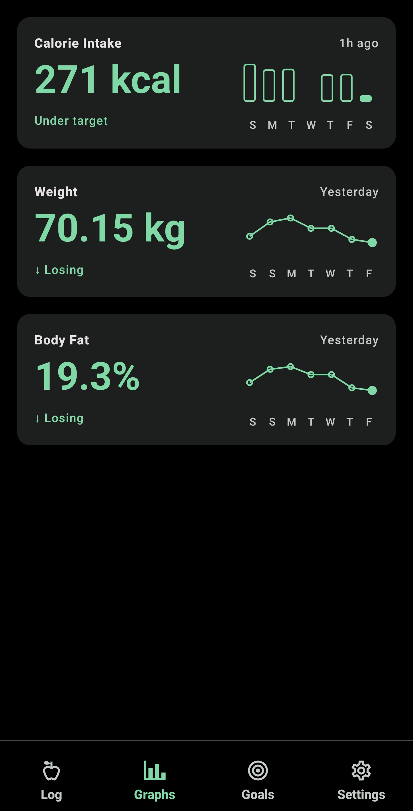
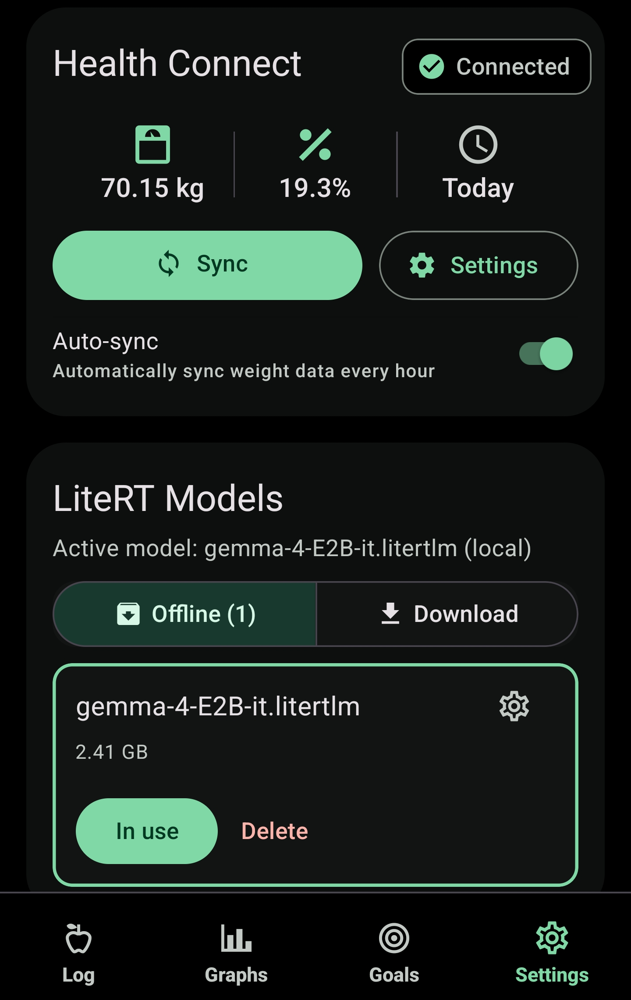

# Calorie Tracker

Simple Expo Android app for logging calories, visualizing weekly trends, and adjusting the daily target from body weight.

## Features

- 🤖 On-device meal estimation with local AI model inference
- 🍽️ Meals, weights, and body-fat logs stored locally in SQLite
- ⚙️ Settings and lightweight preferences stored on-device with MMKV
- 🎯 Daily calorie target from either a fallback goal or latest weight x calories-per-kg multiplier
- 💪 Health Connect weight sync on Android
- 📊 Weekly calorie bar chart
- 📈 Weight trend line chart

## On-device models (LiteRT-LM)

- 📦 AI models are downloaded to the device and run locally using LiteRT-LM: https://github.com/google-ai-edge/LiteRT-LM
- 🔒 No cloud inference is done for model execution after download
- 🛠️ The Settings screen includes controls to download models and run local inference

## Showcase
<br/>
<video src="docs/assets/estimate_meal.mp4" width="300" controls></video>
 
 
<br/>

## Installation

Download the latest APK from the [Releases](../../releases) page and sideload it on your Android device. Requires Android 8+ (API 26).

## Development

### Android

> **Note:** This app uses `react-native-health-connect` and requires a development build. It does not run inside Expo Go.

1. Install dependencies:

```bash
npm install
```

2. Generate the native Android project:

```bash
npm run prebuild
```

3. Build and launch the Android app:

```bash
npm run android
```

4. Start Metro for the development build:

```bash
npm run start
```

## Health Connect notes

- The app requests read access for weight records.
- `minSdkVersion` is set to 26 because Health Connect requires Android 8+

## Acknowledgement

- LiteRT-LM: https://github.com/google-ai-edge/LiteRT-LM
- react-native-litert-lm: https://github.com/hung-yueh/react-native-litert-lm